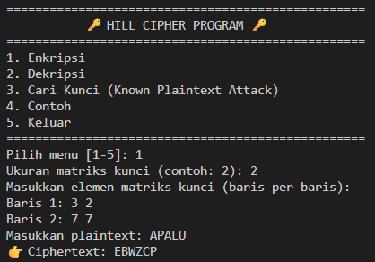
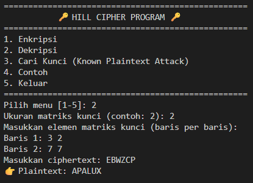
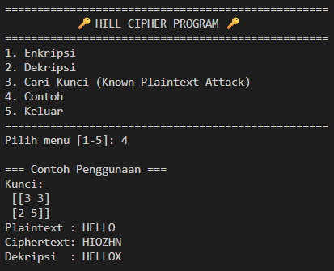

# 🔐 Hill Cipher Program

## 📌 Deskripsi
Program ini mengimplementasikan algoritma **Hill Cipher** menggunakan Python.  
Fitur-fitur utama:
1. **Enkripsi** plaintext menggunakan matriks kunci.  
2. **Dekripsi** ciphertext menggunakan invers matriks kunci.  
3. **Cari Kunci (Known Plaintext Attack)** dari pasangan plaintext–ciphertext.  
4. **Contoh otomatis** untuk memudahkan pemahaman.  

---

## 📌 Alur Program
Saat dijalankan, user akan melihat menu utama:

=== Hill Cipher ===

1. Enkripsi
2. Dekripsi
3. Cari Kunci
4. Contoh
5. Keluar

### 1. Enkripsi
- Input ukuran matriks kunci (contoh: `2` untuk matriks 2×2).  
- Input elemen-elemen matriks kunci baris per baris.  
- Input plaintext (misalnya `HELLO`).  
- Program akan:
  - Konversi huruf → angka (A=0, B=1, ..., Z=25).  
  - Bagi plaintext ke dalam blok sesuai ukuran matriks.  
  - Hitung ciphertext:  
    ```
    C = K × P mod 26
    ```
  - Konversi angka → huruf.  
- Output: ciphertext.

---

### 2. Dekripsi
- Input ukuran matriks kunci dan elemennya.  
- Input ciphertext.  
- Program akan:
  - Cek apakah matriks kunci invertibel mod 26.  
  - Jika tidak invertibel → muncul pesan error.  
  - Jika valid, hitung invers matriks kunci.  
  - Hitung plaintext:  
    ```
    P = K⁻¹ × C mod 26
    ```
- Output: plaintext asli.

---

### 3. Cari Kunci
- Input ukuran matriks kunci (misal `2`).  
- Input plaintext (panjang **harus kelipatan ukuran matriks**).  
- Input ciphertext yang sesuai.  
- Program akan:
  - Bentuk matriks plaintext (P) dan ciphertext (C).  
  - Cek apakah matriks plaintext invertibel mod 26.  
  - Jika invertibel, hitung:  
    ```
    K = C × P⁻¹ mod 26
    ```
  - Jika tidak invertibel → tampilkan pesan error.  
- Output: matriks kunci yang ditemukan.

---

### 4. Contoh
Program otomatis menjalankan contoh bawaan:
- Kunci:  
[3 3]
[2 5]

- Plaintext: `HELLO`  
- Ciphertext: `ZEBBW`  
- Hasil dekripsi kembali → `HELLO`.

---

### 5. Keluar
Mengakhiri program dengan pesan perpisahan.

---

## 📌 Syarat Validitas Kunci
- Determinan matriks kunci **harus relatif prima dengan 26**.  
Artinya:  

gcd(det(K), 26) = 1
- Jika tidak, matriks **tidak punya invers modulo 26**.  
- Dampaknya: enkripsi masih bisa jalan, tapi dekripsi **tidak mungkin**.

---

## 📌 Contoh Pemakaian
### Enkripsi

- Pilih menu [1-5]: 1
- Ukuran matriks kunci: 2
- Baris 1: 3 3
- Baris 2: 2 5
-  Plaintext: HELLO
- Ciphertext: ZEBBW

### Dekripsi
- Pilih menu [1-5]: 2
- Ukuran matriks kunci: 2
- Baris 1: 3 3
- Baris 2: 2 5
- Ciphertext: ZEBBW
- Plaintext: HELLO

### Cari Kunci
- Pilih menu [1-5]: 3
- Ukuran matriks kunci: 2
- Plaintext: HELP
- Ciphertext: ZEBB
- Kunci ditemukan:
- [[3 3]
- [2 5]]


-- -

## 📌 Catatan
- Jika saat memakai fitur **Cari Kunci** muncul error *"Matriks plaintext tidak invertibel modulo 26"*, itu artinya pasangan plaintext–ciphertext yang dimasukkan **tidak bisa digunakan** untuk menemukan kunci (secara matematis tidak mungkin).  
- Gunakan pasangan lain dengan panjang yang sesuai dan matriks plaintext yang invertibel.  

## 📌Bukti screenshoot






