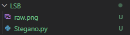
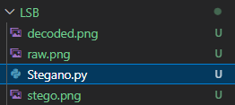

# 🧩 LSB Steganography Program

## 📌 Deskripsi
Program ini mengimplementasikan metode **Steganografi LSB (Least Significant Bit)** menggunakan Python.  
Fitur utama program ini:
1. **Menyisipkan pesan teks** ke dalam gambar (encode).  
2. **Mengambil kembali pesan** dari gambar hasil steganografi (decode).  
3. **Menampilkan hasil decode** dalam bentuk teks dan gambar.

---

## 📌 Alur Program

Saat dijalankan, program melakukan dua tahap utama:

### 1. Encoding (Penyisipan Pesan)
- Fungsi utama:
  ```python
  encode_image(image_path, output_path, message)
  ```
- Input:
  - `image_path`: Gambar asli (misalnya `raw.png`).
  - `output_path`: Nama file hasil (misalnya `stego.png`).
  - `message`: Pesan yang ingin disembunyikan (misalnya `"Go Big"`).
- Proses:
  1. Pesan dikonversi menjadi bentuk **biner 8-bit per karakter**.  
  2. Bit pesan disisipkan ke dalam **bit paling rendah (LSB)** pada tiap komponen RGB piksel.  
  3. Gambar baru dihasilkan dengan pesan tersembunyi.  
- Output:
  ```
  ✅ Pesan berhasil disisipkan. Gambar terenkripsi disimpan di stego.png
  ```

---

### 2. Decoding (Pembacaan Pesan)
- Fungsi utama:
  ```python
  decode_image(stego_path, output_path=None)
  ```
- Input:
  - `stego_path`: Gambar hasil steganografi (`stego.png`).
  - `output_path`: (Opsional) Gambar baru dengan teks hasil decode (`decoded.png`).
- Proses:
  1. Program membaca bit LSB dari seluruh piksel gambar.  
  2. Bit-bit digabung dan dikonversi menjadi karakter teks.  
  3. Proses berhenti ketika menemukan karakter terminator (`chr(0)`).  
- Output:
  ```
  📥 Pesan tersembunyi: Go Big
  📤 Gambar hasil decode disimpan di decoded.png
  ```

---

## 📌 Penjelasan Teknik LSB
Metode **Least Significant Bit (LSB)** bekerja dengan mengganti bit paling rendah dari nilai RGB tiap piksel gambar untuk menyimpan data tanpa mengubah tampilan visual gambar.

Contoh:
```
Pixel RGB asli:   (10101100, 11100101, 10011100)
Bit pesan:        1
Pixel setelah LSB: (10101101, 11100101, 10011100)
```
Perubahan hanya pada bit terakhir, sehingga tidak terlihat oleh mata manusia.

---

## 📌 Struktur Folder

Sebelum program dijalankan:
```
LSB/
├── raw.png
└── Stegano.py
```

Setelah program dijalankan:
```
LSB/
├── raw.png
├── stego.png
├── decoded.png
└── Stegano.py
```

---

## 📌 Hasil Uji Coba

### 💻 Output Program
```
✅ Pesan berhasil disisipkan. Gambar terenkripsi disimpan di stego.png
📥 Pesan tersembunyi: Go Big
📤 Gambar hasil decode disimpan di decoded.png
'Go Big'
```

### 📸 Bukti Screenshot
- Folder **sebelum** dijalankan  
  

- Folder **setelah** dijalankan  
  

- **Hasil running (console)**  
  

- **raw image**  
  

## 📌 Dependensi
Program memerlukan library:
```bash
pip install pillow
```

Import yang digunakan:
```python
from PIL import Image, ImageDraw, ImageFont
```

---

## 📌 Contoh Pemakaian
```python
# Menyisipkan pesan
encode_image("raw.png", "stego.png", "Go Big")

# Mengambil pesan
decode_image("stego.png", "decoded.png")
```

---

## 📌 Catatan
- Hanya mendukung penyisipan **pesan teks** (bukan file).  
- Jika pesan melebihi kapasitas gambar, akan muncul error:
  ```
  ValueError: Pesan terlalu panjang untuk disisipkan ke dalam gambar ini!
  ```
- File `decoded.png` berisi gambar hasil decode dengan pesan ditampilkan di atas gambar.

---

## 📌 Kesimpulan
Metode **LSB Steganography** mampu menyembunyikan pesan secara sederhana dan efektif tanpa mengubah tampilan gambar asli.  
Program ini dapat menjadi dasar untuk pengembangan steganografi tingkat lanjut seperti penyisipan file audio atau gambar lain.
