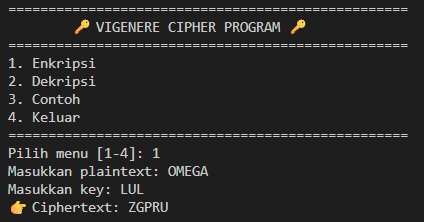
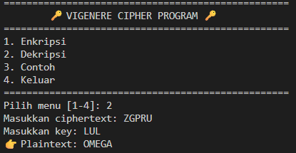
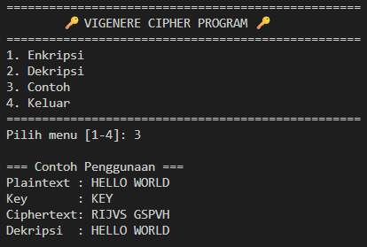

# 🔐 Vigenère Cipher Program

## 📌 Deskripsi
Program ini mengimplementasikan algoritma **Vigenère Cipher** menggunakan Python.  
Fitur-fitur utama:
1. **Enkripsi** plaintext menggunakan kunci huruf.  
2. **Dekripsi** ciphertext dengan kunci huruf.  
3. **Contoh otomatis** untuk memudahkan pemahaman.  

---

## 📌 Alur Program
Saat dijalankan, user akan melihat menu utama:

=== Vigenère Cipher ===

1. Enkripsi  
2. Dekripsi  
3. Contoh  
4. Keluar  

### 1. Enkripsi
- Input plaintext (misalnya `HELLO`).  
- Input kunci (misalnya `KEY`).  
- Program akan:  
  - Konversi huruf → angka (A=0, B=1, ..., Z=25).  
  - Ulangi kunci hingga sepanjang plaintext.  
  - Hitung ciphertext:  
    ```
    C[i] = (P[i] + K[i]) mod 26
    ```
  - Konversi angka → huruf.  
- Output: ciphertext.

---

### 2. Dekripsi
- Input ciphertext.  
- Input kunci.  
- Program akan:  
  - Konversi huruf → angka.  
  - Ulangi kunci hingga sepanjang ciphertext.  
  - Hitung plaintext:  
    ```
    P[i] = (C[i] - K[i]) mod 26
    ```
  - Konversi angka → huruf.  
- Output: plaintext asli.

---

### 3. Contoh
Program otomatis menjalankan contoh bawaan:
- Kunci: `KEY`  
- Plaintext: `HELLO`  
- Ciphertext hasil enkripsi: `RIJVS`  
- Hasil dekripsi kembali → `HELLO`.

---

### 4. Keluar
Mengakhiri program dengan pesan perpisahan.

---

## 📌 Syarat Validitas Kunci
- Kunci **harus berupa huruf alfabet** tanpa spasi.  
- Jika kunci lebih pendek dari plaintext/ciphertext, maka akan **diulang otomatis** hingga panjangnya sama.  
- Jika kunci kosong atau mengandung karakter non-huruf, program tidak dapat berjalan.

---

## 📌 Contoh Pemakaian
### Enkripsi

- Pilih menu [1-4]: 1  
- Plaintext: HELLO  
- Kunci: KEY  
- Ciphertext: RIJVS  

### Dekripsi

- Pilih menu [1-4]: 2  
- Ciphertext: RIJVS  
- Kunci: KEY  
- Plaintext: HELLO  

### Contoh Otomatis

- Pilih menu [1-4]: 3  
- Plaintext: HELLO  
- Kunci: KEY  
- Ciphertext: RIJVS  
- Dekripsi → HELLO  

---

## 📌 Catatan
- Vigenère Cipher merupakan pengembangan dari Caesar Cipher dengan kunci berupa kata, bukan angka tunggal.  
- Semakin panjang dan acak kunci yang digunakan, semakin sulit ciphertext dipecahkan.  

---

## 📌 Bukti Screenshoot
  
  
  
  
